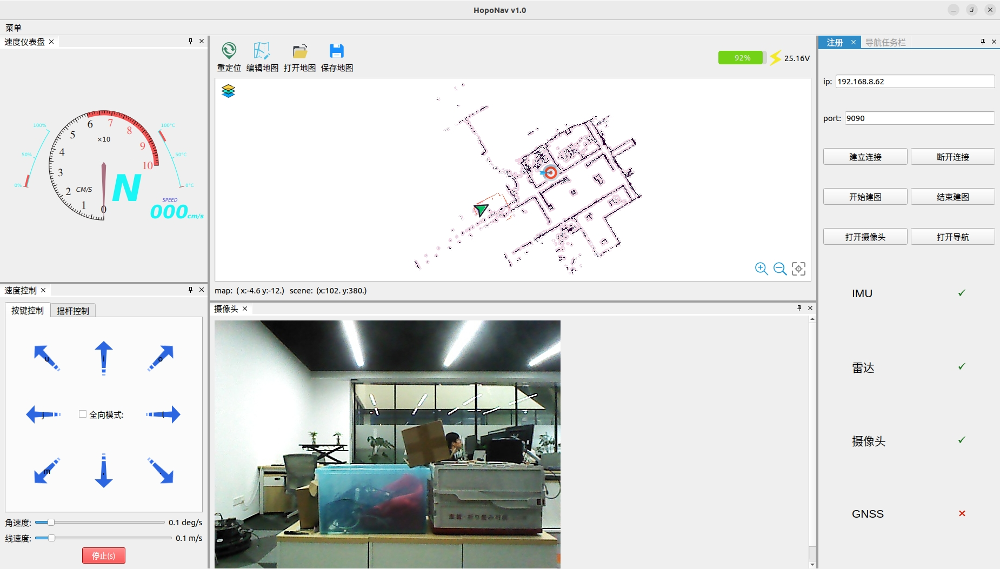
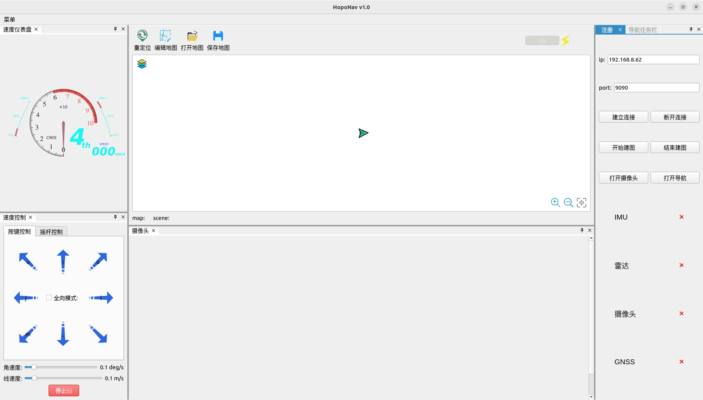
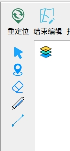

#Ros_Bridge_Gui
一、项目概述

项目名称：基于RosBridge的机器人小车GUI控制界面

项目背景： 机器人小车的远程操作和监控对于自动化和智能控制系统至关重要。为了简化与机器人小车的通信与控制，也为了减少客户机对于ros环境的依赖，本项目开发了一个基于rosbridge协议的图形用户界面（GUI），允许用户通过网络与ROS系统中的机器人小车进行实时数据交互和控制。rosbridge提供了ROS与WebSocket协议的桥接，客户机不需要ros环境也能与小车通信。

主要功能：

1. 小车远程控制：通过GUI提供对机器人小车的远程操控功能，如前进、后退、转向等基本移动控制

2. 传感器数据展示：实时显示来自小车的传感器数据，包括激光雷达、相机、IMU等数据，方便用户监控小车状态

3. 地区建立与保存：根据小车的激光雷达，IMU和摄像头数据，绘制实时环境地图

4. 地图加载与导航：加载建立好的地图，支持导航和路径规划功能

5. 状态监控：显示小车的电池电量、速度、位置等状态信息，帮助用户了解当前运行状态

6. 通信管理：通过rosbridge协议，使用QWebSocket实现与ROS系统的通信，发送和接收ROS消息，确保实时性与稳定性一、项目概述

项目名称：基于RosBridge的机器人小车GUI控制界面
项目背景： 机器人小车的远程操作和监控对于自动化和智能控制系统至关重要。为了简化与机器人小车的通信与控制，也为了减少客户机对于ros环境的依赖，本项目开发了一个基于rosbridge协议的图形用户界面（GUI），允许用户通过网络与ROS系统中的机器人小车进行实时数据交互和控制。rosbridge提供了ROS与WebSocket协议的桥接，客户机不需要ros环境也能与小车通信。

系统架构：

- 前端界面：使用Qt框架开发图形界面，提供用户友好的控制和监控工具

- 通信模块：基于rosbridge的WebSocket通信，使用QWebSocket与ROS服务器进行消息传输，支持JSON格式的数据解析和发送

- 后台处理：从ROS接收实时信息（如传感器数据和导航状态），处理并显示在GUI界面，同时向ROS发送控制指令

开发环境：

- 操作系统：Linux (兼容ROS)

- 开发工具：Qt Creator(5.14.2), CMake, ROS2,GCC

- 依赖库：

  - Qt5（用于界面设计和通信）
  
  - qtbase5-dev (Qt 5 基础开发库，包含构建 Qt 应用程序所需的核心模块)
  
  - QWebSocket（用于实现WebSocket通信）
  
  - qtbase5-dev-tools (Qt 5 的开发工具集，包括一些辅助开发和调试的工具)
  
  - libqt5svg5-dev (Qt 5 的 SVG 库开发包，用于处理和显示 SVG)
  
  - qtbase5-private-dev (Qt 5 的私有开发库，包含不对外暴露的 Qt 内部 API，用于开发依赖 Qt 内部接口的应用)
  
  - libeigen3-dev (Eigen3 的开发包，Eigen 是一个高效的线性代数库，提供矩阵和向量的操作)
  
  - Boost （更便捷的跨平台）
  
目标用户： 本项目面向需要简化机器人小车控制和监控的用户群体，特别适用于工业自动化、无人驾驶测试和农业导航等领域

项目特点：

- 无需深入了解ROS的使用者也可以通过图形界面轻松操作和监控机器人小车

- rosbridge提供了与ROS系统的解耦，方便后续扩展到Web或移动应用等多平台操作

- 实时传输与处理确保了小车与操作端的高效通信与响应

二、安装与部署

1. 系统要求：

  - 操作系统：Linux（客户端） linux（支持ros2,服务端）
  
  - ROS版本：humble（服务端）
  
2. 服务器端操作：(firefly机器人小车，环境是ros2 humble，rosbridge已经安装，默认打开端口是9090)

  - 启动底盘运动控制节点 lpy  ros2 launch turn_on_wheeltec_robot turn_on_wheeltec_robot.launch.py
  
     lpy和wheel环境的区别在于电池发布的消息格式不同
     
  - 打开摄像头  lpy   ros2 launch astra_camera astra_mini.launch.py
  
  - 打开雷达   lpy        ros2 launch livox_ros_driver2 rviz_MID360_launch.py
  
  - 打开3D到2D的点云转换    wrh    ros2 launch pointcloud_to_laserscan sample_pointcloud_to_laserscan_launch.py
  
  - 发布雷达与base_footprint的静态坐标转换   wrh   ros2 run tf2_ros static_transform_publisher 0.1 0.0 0.2 0.0 0.0 0.0 1.0 base_footprint livox_frame
  
  - 启动导航   wrh   ros2 launch fishbot_navigation2 navigation2_wheel2.launch.py
  
  - 发布机器人位姿   lpy  ros2 run pose_pub robot_pose_publisher
  
  - 启动rosbridge   ros2 launch rosbridge_server rosbridge_websocket_launch.xml
  
3. 客户端（Linux环境）：

  - 执行下面指令安装需要的库 sudo apt-get install qtbase5-dev qt5-qmake qtbase5-dev-tools libqt5svg5-dev qtbase5-private-dev libeigen3-dev libgtest-dev libsdl-image1.2-dev libsdl1.2-dev -y
  
  - 安装boost库  sudo apt-get install libboost-all-dev -y
  
  - 将这些库安装之后即可编译本项目
  
  进入Qt_Bridge_Gui打开终端，mkdir build ，cd  build，cmake ..  ，make(想要加快速度可以用 make -j8) ，编译完成后运行项目 ./qt_bridge_gui
  
  - 如果后期想要修改代码，可以使用vscode或者qtcreator，我在开发本项目时使用的是qtcreator 5.14.2
  
  - 跨平台编译（windows）qt具有良好的跨平台功能，将本项目全部复制到windows环境下，安装windows下的eigen包和boost包，在windows下安装qtcreator，安装编译工具MinGW，编译本项目
  
  - 跨平台编译（Linux或者windows向安卓编译）安装jdk，android sdk ，android ndk，安装安卓环境的boost库，即可交叉编译到安卓平台
  
三、代码结构与模块说明

1. 目录结构：

  ├── ads
  
  │   ├── dockWidget
  
  │   ├── JsonStruct
  
  │   └── yaml-cpp
  
  ├── basic
  
  │   ├── algorithm
  
  │   ├── CMakeLists.txt
  
  │   ├── map
  
  │   ├── msg
  
  │   ├── point
  
  │   └── str_enum.h
  
  ├── cmake
  
  │   ├── GTestHelper.cmake
  
  │   └── TargetNameHelper.cmake
  
  ├── CMakeLists.txt
  
  ├── CMakeLists.txt.user
  
  ├── common
  
  │   ├── build
  
  │   ├── CMakeLists.txt
  
  │   ├── include
  
  │   └── src
  
  ├── core
  
  │   ├── CMakeLists.txt
  
  │   ├── main.cpp
  
  │   └── runtime
  
  ├── doc
  
  │   ├── develop_guide.md
  
  │   └── images
  
  ├── mainwindow
  
  │   ├── CMakeLists.txt
  
  │   ├── include
  
  │   ├── resource
  
  │   ├── src
  
  │   └── ui
  
  ├── plugin
  
  │   ├── CMakeLists.txt
  
  │   └── task_processor
  
  └── README.md
  
2. 模块划分：
  - ads qt的高级停靠窗口，能够实现窗口覆盖，多个窗口折叠，一些json格式配置
  
  - Basic  消息格式类型，机器人结位置结构体，图层数据结构体
  
  - Mainwindow 实现整个项目功能
  
3. 代码逻辑：

  - 接收与显示主要使用qt中的信号和槽，点击连接之后，会启动一个线程去连接服务器，同时开始接收小车电池电量，IMU数据，当有消息收到时会判断是不是需要的数据，如果是发送信号到主线程更新ui界面，模块之间采用多线程呢操作，各个线程互不影响
  
四、操作指南

- ip地址和端口号我设置了一个默认的，可以随意更改，按照上面 二（服务器端操作）之后，点击建立连接，如果连接成功会有连接成功提示，出错则会显示报错信息，连接成功后速度仪表盘，速度控制盘，电源电压即会正常工作，点击打开摄像头按钮，摄像头将会开始工作,点击开始导航，将会加载地图和机器人位置如图

开始建图和结束建图都会在服务器打开终端执行建图和保存地图的功能

重定位功能可以移动小车位置

编辑地图从上到下依次是恢复鼠标功能，发布导航点，橡皮擦，铅笔，画直线功能，能够对打开的地图进行操作，保存地图可以将修改后的图片进行保存

导航状态栏添加点可以将所有发布的导航点添加进去进行多点导航，循环导航
